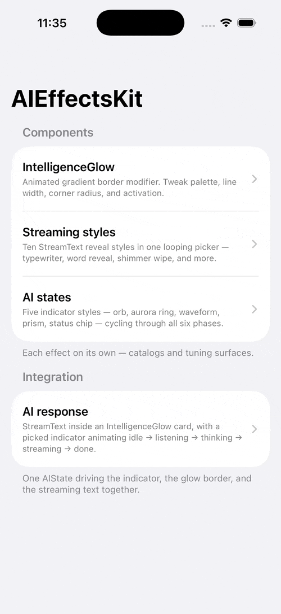
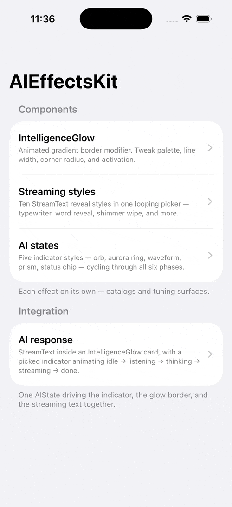
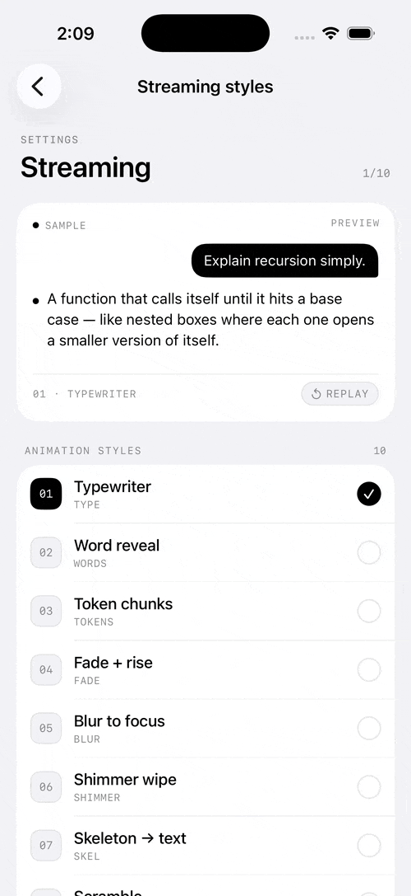
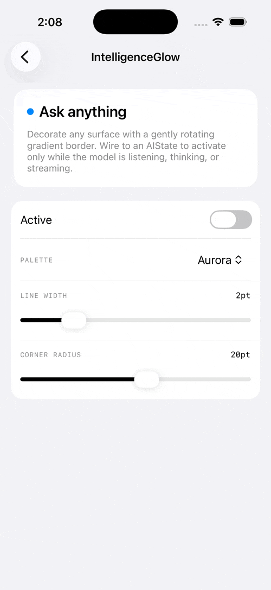
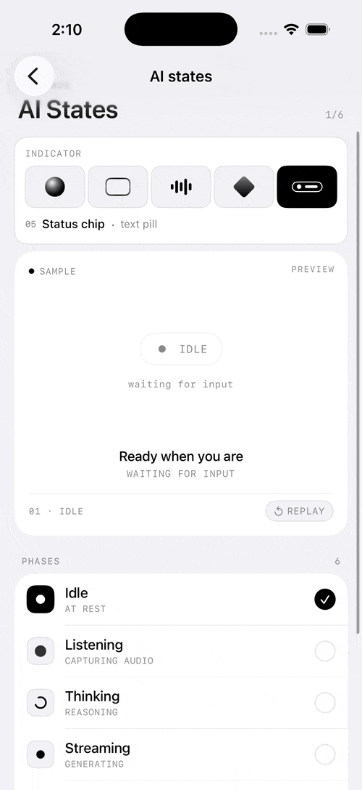

# AIEffectsKit

[](https://swiftpackageindex.com/chrisnyw/AIEffectsKit)
[](https://swiftpackageindex.com/chrisnyw/AIEffectsKit)

[](https://github.com/chrisnyw/AIEffectsKit/blob/main/LICENSE)

**The visual language of generative AI for SwiftUI** — state-driven, accessibility-correct, ready for Metal acceleration.

<p align="center"> </p>

> Ships `StreamText`, `ThinkingIndicator`, `IntelligenceGlow`, and a shared `AIState` that ties them together. `StreamText` offers **eleven** reveal styles, powered by the iOS 18 `TextRenderer` API with iOS 17 fallbacks. Every effect auto-degrades under Reduce Motion / Reduce Transparency / Low Power Mode.

## Why

Apple Intelligence has settled into a recognisable visual language — the breathing glow, the streaming reveal, the trailing shimmer. No library packages it coherently. AIEffectsKit fills that gap with a small surface of composable, state-driven SwiftUI primitives.

## Install

Swift Package Manager:

```swift
.package(url: "https://github.com/<owner>/AIEffectsKit.git", from: "0.2.0")
```

Then:

```swift
import AIEffectsKit
```

## Components at a glance

| Component | Description |
|---|---|
| `StreamText` | Token-by-token reveal driven by any `AsyncSequence<String>`. Eleven styles — `.trailingShimmer`, `.typewriter`, `.wordReveal`, `.tokenChunks`, `.fadeRise`, `.blurFocus`, `.shimmerWipe`, `.skeleton`, `.scramble`, `.letterDrop`, `.lineCascade`. |
| `ThinkingIndicator` | Compact three-dot pulse that renders only while `AIState.phase == .thinking`. |
| `.intelligenceGlow(…)` | View modifier — animated rotating gradient border. Activates from a shared `AIState` or an explicit `activeWhen:` flag. |
| `AIState` / `AIPhase` | Shared observable state: `.idle` · `.listening` · `.thinking` · `.streaming` · `.done` · `.error(String)`. Injected via `.aiState(_:)`. |

## Output samples

| Component | Preview |
|---|---|
| `StreamText` | </p> |
| `IntelligenceGlow` | </p> |
| `ThinkingIndicator` | </p> |

## Quick start — `StreamText`

Wrap any `AsyncSequence<String>`, choose a style:

```swift
StreamText(llmTokenStream, style: .trailingShimmer())
    .font(.title3)
```

Pick any of the eleven styles:

```swift
StreamText(source, style: .typewriter())
StreamText(source, style: .wordReveal())
StreamText(source, style: .shimmerWipe())
// …
```

For demos and deterministic previews, use the built-in typing helper:

```swift
StreamText.typing(
    "The quick brown fox jumps over the lazy dog.",
    interval: .milliseconds(30),
    style: .fadeRise()
)
```

## Quick start — `IntelligenceGlow`

A modifier that paints an animated gradient border around any surface:

```swift
ChatBubble()
    .intelligenceGlow(
        colors: [.blue, .purple, .pink, .blue],
        lineWidth: 2,
        cornerRadius: 16,
        activeWhen: true            // or omit to read AIState from the environment
    )
```

When wired to an `AIState`, the glow breathes only while the phase is active (listening / thinking / streaming).

## Quick start — `ThinkingIndicator`

```swift
VStack {
    ThinkingIndicator()            // renders only while .phase == .thinking
    Text("Working on it…")
}
.aiState(state)
```

## Tying it together with `AIState`

```swift
@State private var state = AIState()

VStack {
    ThinkingIndicator()
    StreamText(tokenStream)
        .intelligenceGlow(cornerRadius: 16)
}
.aiState(state)
```

`StreamText` reports its own phase transitions (`.streaming` → `.done` / `.error`) to the injected `AIState`; the indicator and the glow both observe the same instance.

## Platforms

- iOS 17+, macOS 14+, watchOS 10+, visionOS 1+
- Xcode 16+ / Swift 5.10+ (Swift 6 strict concurrency supported)
- The `TextRenderer` shimmer engages on iOS 18 / macOS 15 / watchOS 11 / visionOS 2 and later; earlier targets get a plain animated `Text` fallback.

## Accessibility

Every animated effect collapses to a static, phase-appropriate fallback when any of:

- `accessibilityReduceMotion`
- `accessibilityReduceTransparency`
- `ProcessInfo.isLowPowerModeEnabled`

is on. No configuration required.

## Demo

Open `Example/AIEffectsKitDemo.xcodeproj` and run — the project references this package locally (`XCLocalSwiftPackageReference ".."`) so there's no dependency resolution step.

The demo ships four screens grouped as **Components** (each effect on its own) + **Integration** (everything together). See [`Example/README.md`](Example/README.md).

## Roadmap

| Release | Scope | Status |
|---|---|---|
| **v0.1.0** | `StreamText` solo (iOS 18 `TextRenderer`, one style) | ✅ shipped |
| **v0.2.0** | `ThinkingIndicator`, pure-SwiftUI `IntelligenceGlow`, `AIState` wiring, `StreamText` expanded to 11 styles, accessibility infra, demo feature-folder architecture | ✅ shipped |
| v1.0.0 | Metal `layerEffect`, `AIRipple`, `GenerationPlaceholder`, hero demo app, FoundationModelsKit integration | planned |

See [`AIEffectsKit-PLAN.md`](AIEffectsKit-PLAN.md) for positioning, market research, and kill-switches.

## License

MIT — see [LICENSE](LICENSE).
